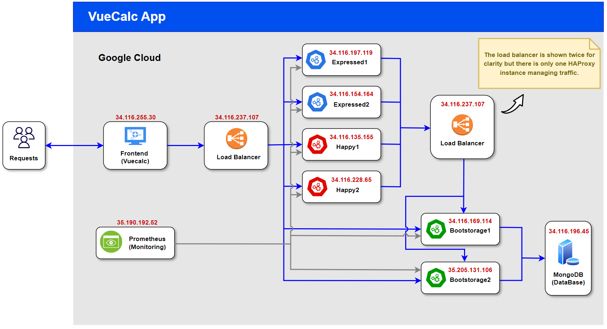

# agisit24-g9

# VueCalc Cloud Project

The **VueCalc Cloud Project** is a cloud-native, microservices-based calculator application. The frontend is developed using Vue.js, and it interacts with **Expressed** and **Happy** backend services to perform arithmetic operations. These backend services are replicated across several instances for load balancing, which is managed using **HAProxy**.

The deployment process is fully automated with **Terraform** for infrastructure provisioning and **Ansible** for configuration management. All services are containerized with **Docker**, and traffic is routed through the load balancer to distribute requests efficiently across the backend services.

Data persistence is handled by **MongoDB**, hosted on a self-managed virtual machine. The **Bootstorage** microservice stores the history of all arithmetic operations in MongoDB, enabling data retrieval for the application's history feature.

**Prometheus** is used for monitoring the performance and health of all microservices, including Expressed, Happy, and Bootstorage. Metrics such as latency, total request count, and error rates are tracked, ensuring visibility into the system's behavior and performance.




## Project Team

| **Name**           | **Student ID** |
|--------------------|----------------|
| Diogo Pereira       | 110996         |
| João Matos          | 110846         |
| João Santos         | 110947         |

---

## Application Overview

**VueCalc** is a browser-based calculator that supports a range of arithmetic operations, including addition, subtraction, multiplication, division, and modulo (custom-added feature).

### Features:
- **Addition** and **Subtraction**: Handled by the **Expressed** microservice.
- **Multiplication**, **Division**, and **Modulo**: Handled by the **Happy** microservice.
- **History Tracking**: All operations are logged and stored in **MongoDB** through the **Bootstorage** microservice.
  
### Additional Custom Feature:
- The **Modulo** operation (`/api/happy/modulos`) was added to the **Happy** service as part of the project's customization, allowing users to calculate remainders in division operations.

## Architecture

### 1. **Frontend**:
- **VueCalc**: A Vue.js-based frontend that communicates with the backend services.
  - API.js configures requests to point to the load balancer, which routes the requests to the appropriate backend service.

### 2. **Microservices**:
- **Expressed**:
  - Handles addition (`/api/express/add`) and subtraction (`/api/express/subtract`).
  - Written in Node.js using Express.
  
- **Happy**:
  - Handles multiplication (`/api/happy/multiply`), division (`/api/happy/divide`), and the custom modulo operation (`/api/happy/modulos`).
  - Written in Node.js using Hapi.js.

- **Bootstorage**:
  - A Spring Boot microservice that stores operation history and interacts with MongoDB.
  - Logs each calculation request and stores it in MongoDB (`/api/bootstorage/create`).

### 3. **Database**:
- **MongoDB**:
  - Stores the history of all arithmetic operations performed through the app.
  - Hosted on a self-managed MongoDB instance.

### 4. **Load Balancer**:
- **HAProxy**:
  - Ensures even distribution of requests between the frontend and backend microservices:
    - Requests from VueCalc to the Expressed (addition/subtraction), Happy (multiplication/division/modulo), and Bootstorage (history feature) services are routed through the load balancer.
    - Requests from Expressed and Happy to Bootstorage for storing operation results are also balanced across multiple Bootstorage instances.
  - Uses round-robin load balancing and performs health checks to ensure high availability and even traffic distribution across all service instances.
  - Configuration allows monitoring through `/haproxy?stats` using username and password.

### 5. **Monitoring**:
- **Prometheus**:
  - Monitors all microservices, tracking key metrics such as average latency, total request count, and error rates. In addition to these service-specific metrics, Prometheus also tracks default metrics like memory usage and uptime.
  - Each microservice (Expressed, Happy, and Bootstorage) exposes metrics via specific endpoints, which Prometheus scrapes periodically to gather performance data.
  - Provides real-time visibility into the behavior and health of the system.
  - Metrics can be accessed and monitored through the Prometheus dashboard (metrics are refreshed every 15 seconds to ensure up-to-date monitoring).

## Infrastructure Setup

The infrastructure is deployed on **Google Cloud Platform (GCP)** using a combination of tools to automate both the provisioning and configuration of resources:

- **Vagrant**: Initializes a management VM (`mgmt`) which orchestrates the deployment process.
- **Terraform**: Automates the provisioning of GCP resources, including virtual machines (VMs) for the frontend, backend services, load balancer, prometheus, and MongoDB database. It also sets up networking components like firewalls.
- **Ansible**: Handles the configuration of the VMs, installs necessary software, and deploys Docker containers for each microservice through Ansible Playbooks.
- **Docker**: Each microservice runs inside Docker containers for consistency and ease of deployment.


## Installation and Setup

### Prerequisites:
1. **Vagrant**: To set up the management VM.
2. **Google Cloud SDK**: For controlling GCP resources via CLI.
3. **Terraform**: To provision infrastructure on GCP.
4. **Ansible**: For automating the deployment process.

### Setup Instructions (via PowerShell):
1. **Start the Management VM**:
   ```bash
   $env:VAGRANT_VAGRANTFILE = "Vagrantfile.vbox"
   vagrant up
   vagrant ssh mgmt
   ```

2. **Generate SSH Keys on Management VM**:
   ```bash
   ssh-keygen -t rsa -b 2048
   ```

3. **Provision Infrastructure**:
   Navigate to the `gcpcloud` folder and run:
   ```bash
   cd ~/agisit24-g9/agisit24-g9/gcpcloud/
   terraform init
   terraform apply
   ```

4. **Start the Machines:**:
   After provisioning the infrastructure, the virtual machines need to be **started**. Run the following script to automatically start all the instances:
   ```bash
   ./start_instances.sh
   ```
    You may need to authenticate and set the required property [project] first, by running the commands: 
    ```
    gcloud auth login
    ```
    ```
    gcloud config set project agisit-2425-website-g09
    ```

5. **Configure Machines**:
   After the VMs are created on GCP, run the Ansible playbooks to set up and deploy the application:
   ```bash
   cd ~/agisit24-g9/agisit24-g9/gcpcloud/
   ansible-playbook -i ./gcphosts ansible-gcp-servers-setup-all.yml
   ```

### Deployment Details:
- **Frontend**: Deployed on VueCalc VM and available via port 2000 (External IP: 34.116.255.30).
- **Backend Microservices**: Deployed on Expressed, Happy, and Bootstorage VMs, all accessible via load balancer.
- **Bootstorage**: Deployed on its dedicated VM and connected to MongoDB.
- **MongoDB**: Self-hosted, deployed on its dedicated VM.
- **HAProxy**: Deployed on balancer VM and configured via Ansible playbooks. 
- **Prometheus**: Deployed on its dedicated VM to monitor all microservices.
  
## Running the Application
Once the setup is complete, you can access the **Vuecalc calculator frontend** through the following URL:
```
http://34.116.255.30:2000
```
This will open the web interface where you can input numbers and perform operations such as addition, subtraction, multiplication, division, and modulo. The operations are processed by the backend microservices and the results are stored in Bootstorage, which connects to MongoDB for persistence.

---

### HAProxy Stats:
Monitor the status of the backend services. You can see the **Bytes In/Out** column in the stats table on this page, which shows the traffic handled by each microservice instance, confirming that the requests are being balanced across them.

For example, if you perform a sum operation, you might notice that one `Expressed` instance has higher Bytes In/Out compared to the other. After performing another sum operation, you'll see that the values for Bytes In/Out become more similar between both instances, indicating that the load balancing mechanism is distributing the requests evenly between them. The same for the other services `Happy` and `Bootstorage`

You can check this behavior by visiting the following link with the credentials provided:

```
http://34.116.237.107:8080/haproxy?stats
```

Username: ```admin```
Password: ```agisit24-g9```

---

### Prometheus Metrics and Monitoring
We have integrated **Prometheus** for monitoring the health and performance of the backend microservices, including **Expressed, Happy, and Bootstorage**. The configuration tracks key metrics for each microservice such as **request count**, **request duration**, and **error rates** (plus the default ones).
  - The **Expressed** and **Happy** microservices are configured to **expose metrics** via its `/metrics` endpoint.
  - The **Bootstorage** microservice is configured to **expose metrics** via its `/actuator/prometheus` endpoint.

#### Prometheus Dashboard
To view the metrics, access the Prometheus UI by navigating to the Prometheus server:

(Note that Prometheus collects metrics periodically, so it may take some time for the latest data to be displayed)
```
http://35.190.192.52:9090/
```

You can query detailed metrics for each microservice through the Prometheus query interface or by accessing the individual instance endpoints that provide scraped metrics:

##### **Expressed**:

All in one (page) metrics for Expressed instances:
```
Expressed1: http://34.116.197.119:3000/metrics
```

```
Expressed2: http://34.116.154.164:3000/metrics
```

- **Average Latency**  (over the last 5 minutes):
  - For expressed1: 
  ```
  rate(express_http_request_duration_seconds_sum{job="expressed1"}[5m]) / rate(express_http_request_duration_seconds_count{job="expressed1"}[5m])
  ```

  - For expressed2:
  ```
  rate(express_http_request_duration_seconds_sum{job="expressed2"}[5m]) / rate(express_http_request_duration_seconds_count{job="expressed2"}[5m])
  ```

  - **Total Request Count**:
  ```
  express_http_requests_total
  ```
---
##### **Happy**:

All in one (page) metrics for Happy instances:
```
Happy1: http://34.116.135.155:4000/metrics
```

```
Happy2: http://34.116.228.65:4000/metrics
```

- **Average Latency**  (over the last 5 minutes):
  - For happy1:
  ```
  rate(happy_http_request_duration_seconds_sum{job="happy1"}[5m]) / rate(happy_http_request_duration_seconds_count{job="happy1"}[5m])
  ```
  - For happy2: 
  ```
  rate(happy_http_request_duration_seconds_sum{job="happy2"}[5m]) / rate(happy_http_request_duration_seconds_count{job="happy2"}[5m])
  ```
  - **Total Request Count**: 
  ```
  happy_http_requests_total
  ```
---

##### **Bootstorage**:

All in one (page) metrics for Bootstorage instances:
```
Bootstorage1: http://34.116.169.114:5000/actuator/prometheus
```

```
Bootstorage2: http://35.205.131.106:5000/actuator/prometheus
```

- **Average Time Per Request** (over the last 5 minutes):
  - For bootstorage1:
  ```
  rate(http_server_requests_seconds_sum{job="bootstorage1"}[5m]) / rate(http_server_requests_seconds_count{job="bootstorage1"}[5m])
  ```
  - For bootstorage2: 
  ```
  rate(http_server_requests_seconds_sum{job="bootstorage2"}[5m]) / rate(http_server_requests_seconds_count{job="bootstorage2"}[5m])
  ```
- **Total Request Count - Create an operation in MongoDB**:
  ```
  http_server_requests_seconds_count{exception="None",method="POST",outcome="SUCCESS",status="200",uri="/api/bootstorage/create",}
  ```

- **Total Request Count - Retrieve the past calculation operations**:
  ```
  http_server_requests_seconds_count{exception="None",method="GET",outcome="SUCCESS",status="200",uri="/api/bootstorage/operations",}
  ```

You can monitor these metrics via their endpoints or use the Prometheus dashboard to query and visualize the system's performance across different microservices.

---
### Stopping the Machines
After completing your tasks, you can stop the machines by running:
```
cd ~/agisit24-g9/agisit24-g9/gcpcloud/
./stop_instances.sh
```

---